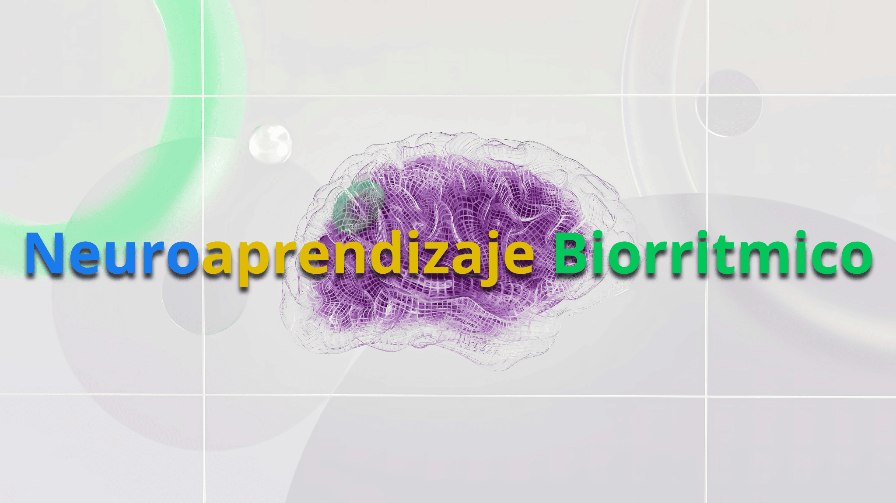

# Neuroaprendizaje Biorrítmico

#### NOTA DEL AUTOR: Este borrador del proyecto presenta a NABR, una idea consolidada y en constante formacion y adaptabilidad que esta puesta al servicio de toda la humanidad buscando aumentar el potencial humano en esta nueva era tecnológica.

# Enlaces a los chats de AI

A continuación figuran los enlaces a los chats de AI de los que se extrajo la información para los documentos de investigación:

- [ChatGPT](https://chatgpt.com/share/6713046e-0178-8007-b421-2860880e8e96)
- [Perplexity](https://www.perplexity.ai/search/necesito-que-me-ayudes-a-depur-nQrpqXRMSR2TcXhqOV6r4A)
- [Gemini](https://g.co/gemini/share/6bbbb2d76d0d)
- [Claude - Temporary Unavailable](https://claude.ai/)
- [MS Copilot - Temporary Unavailable](https://copilot.microsoft.com/)
- [Meta AI - Temporary Unavailable](https://www.meta.ai/)
- [Mistral](https://chat.mistral.ai/chat/a8a90b89-9b3f-4bad-b381-1ce304bf951d)
- [Cohere](https://coral.cohere.com/share/d8ca2bcb-d573-443d-9db1-66101dd93720)
- [Waldo](https://www.waldo.fyi/project/109621)
- [Huggingchat - 7 LLM's - Temporary Unavailable](https://huggingface.co)

Estos enlaces proporcionan más contexto y detalles sobre la investigación que apoya la idea del proyecto de Neuroaprendizaje Biorrítmico.

PD: El libro que brindo los conocimientos que impulsaron esta idea provienen de ["Somos Nuestra Memoria - Recordar y olvidar" de Emilio García García.](https://www.google.com.co/books/edition/Somos_nuestra_memoria/Ov30uQEACAAJ?hl=es-419)

## Descripción del Proyecto
El **Neuroaprendizaje Biorrítmico** será una metodología innovadora que combinará datos biométricos y neurocognitivos para personalizar el proceso de aprendizaje. Utilizaremos dispositivos como smartwatches y anillos inteligentes para medir parámetros biológicos y, a través de inteligencia artificial, adaptaremos el contenido educativo a las capacidades individuales.

## Problema que Resolveremos
El aprendizaje tradicional no toma en cuenta el estado biológico y cognitivo del estudiante. Nuestro proyecto medirá datos biométricos (frecuencia cardíaca, nivel de estrés, actividad cerebral) y adaptará el contenido educativo para optimizar la experiencia de aprendizaje.

## Solución
1. **Captura de datos biométricos en tiempo real**: Utilizaremos dispositivos wearables para recopilar datos biométricos.
2. **Procesamiento y análisis de datos con IA**: Implementaremos IA para interpretar el estado fisiológico y neurocognitivo del usuario.
3. **Adaptación dinámica del contenido educativo**: Ajustaremos el contenido educativo según el estado óptimo de aprendizaje del usuario.

## Arquitectura del Proyecto
- **Dispositivos de Medición**: Smartwatches, anillos inteligentes (Apple Watch, Oura Ring, etc.)
- **Procesamiento de Datos**: Algoritmos de IA que analizarán las señales biométricas y ajustarán el contenido educativo.
- **Aplicación de Aprendizaje Adaptativo**: Plataforma o sistema que entregará el contenido personalizado.

## Tecnologías Utilizadas
- Python (para procesamiento de datos e IA)
- API de dispositivos biométricos (Apple Health, Google Fit)
- Framework de aprendizaje adaptativo (p.ej. TensorFlow, PyTorch)
- GitHub Actions para la automatización del CI/CD

## Cómo Ejecutar el Proyecto
1. Clona este repositorio: `git clone https://github.com/usuario/proyecto-neuroaprendizaje-biorritmico.git`
2. Instala las dependencias: `pip install -r requirements.txt`
3. Configura tu dispositivo biométrico siguiendo las instrucciones en `/docs/setup_dispositivos.md`
4. Corre el script de análisis de datos: `python analysis.py`

## Documentación
- **Concepto del Proyecto**: Descripción detallada de tu metodología de neuroaprendizaje biorrítmico.
- **Arquitectura del Sistema**: Diagrama y explicación de cómo se integrarán los componentes tecnológicos y algoritmos.
- **Guía Técnica**: Instrucciones técnicas para desarrolladores interesados en contribuir.
- **Resultados y Validaciones**: Resultados preliminares de pruebas o validaciones que se realizarán.

## Contribuciones
¡Estaremos abiertos a contribuciones! Por favor, lee nuestra guía de contribuciones en `/docs/CONTRIBUTING.md`.

## Licencia
Este proyecto estará bajo la licencia MIT. Consulta el archivo LICENSE para más detalles.
